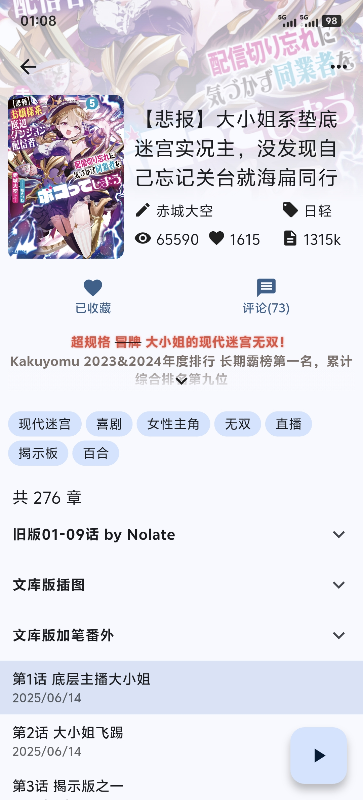

# Esjzone

一款基于 Flutter 开发的 [Esjzone](https://www.esjzone.one/) 第三方应用

前往 [Releases](../../releases) 以获取构建好的安装包

欢迎提交 [issues](https://github.com/EnableAria/Esjzone/issues) 以协助开发

## 软件截图

<table>
    <tr>
        <td></td>
        <td></td>
        <td></td>
    </tr>
</table>

## 致谢

感谢 [DeeChael](https://github.com/DeeChael) 整理的有关 Esjzone 网络请求的文档